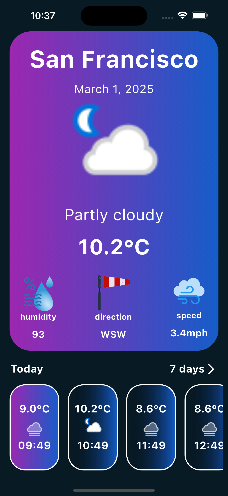
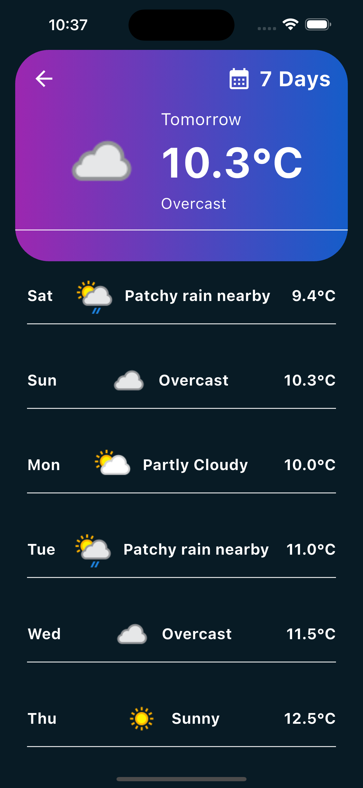

# 🌤️ Weather Forecast App

## 📌 Overview
The **Weather Forecast App** is a Flutter-based application that provides real-time weather updates using [WeatherAPI.com](https://www.weatherapi.com/). It predicts weather conditions based on the device's current location and offers a 7-day forecast.

## ✨ Features
- 📍 **Location-Based Weather** – Automatically detects the device's location to fetch weather data using **Flutter Geolocator** package.
- ⏳ **Hourly Forecast** – Displays weather conditions for different hours of the day.
- 📆 **7-Day Forecast** – Predicts weather conditions up to 7 days ahead.
- 🌡️ **Temperature, Humidity, Wind Speed & More** – Provides detailed weather parameters.
- 🎨 **Beautiful UI** – A sleek and modern design with gradient backgrounds.

## 🖥️ Screenshots
### Home Screen
<div align="center">

</div>

### 7-Day Forecast
<div align="center">

</div>


## 🎥 Demo Video
<div align="center">

</div>

SCREEN RECORDING ON IPHONE 15 PRO MAX EMULATOR
## 🛠️ Technologies Used
- **Flutter** – Cross-platform framework for building the app.
- **Dart** – Programming language used in Flutter.
- **WeatherAPI.com** – API for fetching weather data.
- **Provider** – State management solution.
- **Flutter Geolocator** – Package for retrieving real-time device location.

## 🚀 Getting Started
### Prerequisites
- Install Flutter: [Flutter Docs](https://docs.flutter.dev/get-started/install)
- Set up an iOS simulator 
- Get an API key from [WeatherAPI.com](https://www.weatherapi.com/)

### Installation
```sh
# Clone the repository
cd weather-forecast-app

# Install dependencies
flutter pub get

# Run the app
flutter run
```


## 🤝 Contributing
Feel free to fork this repository, submit issues, and make pull requests to improve the app!

Enjoy using the **Weather Forecast App**! ☀️🌧️

